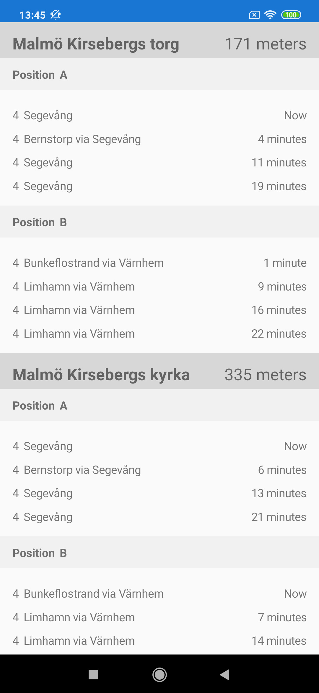
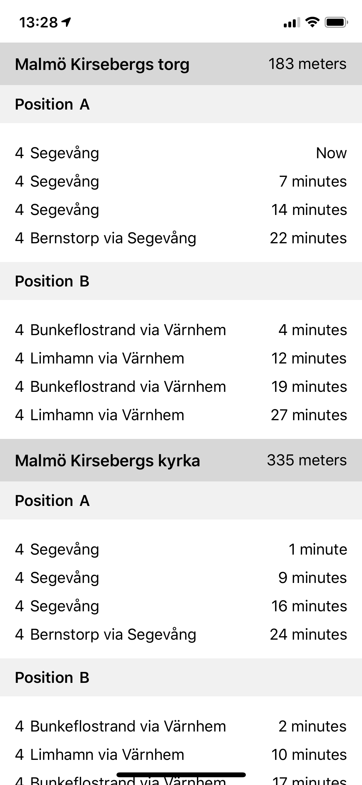

# Project “Commuter”

Mobile app for daily commuters in Skåne region, Sweden. 

For iOS and Android.

## User Story

As a daily Commuter, I want to be able to see the upcoming Departures at the closest Stop Areas so that I know when to leave for/from work.
 
### Acceptance Critera

* List all Departures at Stop Areas within a certain radius.
* Show the distance to a stop area relative to the Commuter/User.
* UX should look similar to how Skånetrafiken's (the regional collective traffic service) departure boards look.

## Specification
This has been implemented:

* Shows all available modes of transportation
* Preset radius of 400 meters
* Refreshes automatically every 10 seconds
* Pull-to-refresh
* Uses Skånetrafiken's [Open API](http://www.labs.skanetrafiken.se/default.asp)
* Available for iOS och Android
* Built on .NET with Xamarin.Forms

## Screenshots

Android:

iOS:

## Futures
* Stabilization
* Set custom radius
* Localization
* Watchlist and Alarm
* Widgets for iOS and Android
* Integration with Skånetrafiken app: linking

## License
Apache License, Version 2.0